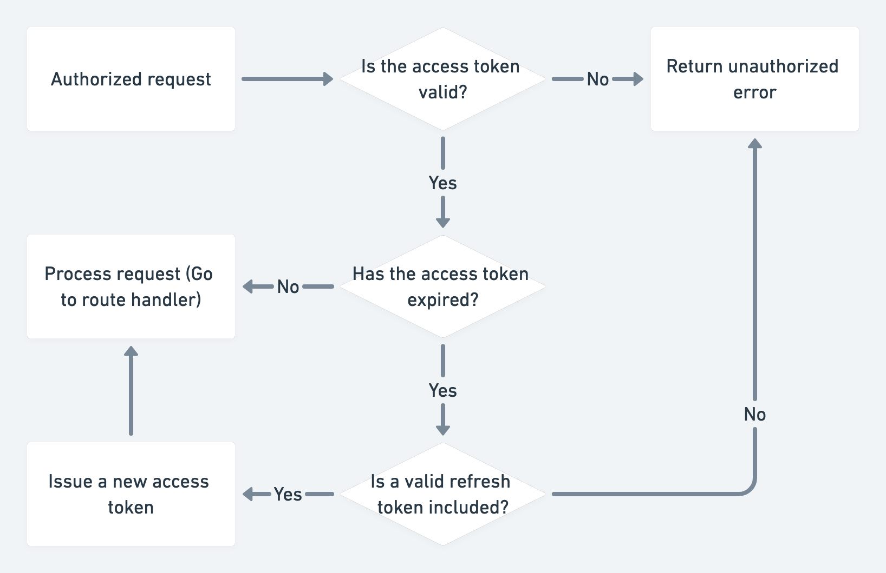

# REST API with Node.js, Mongoose & TypeScript + Zod for validation

Note: This repository includes the [postman collection for the finished API](postman_collection.json)

Note 2: Make sure you add .env to your .gitignore before pushing any changes to your repository. You will also want to generate new public & private keys

#### Generate new keys: https://travistidwell.com/jsencrypt/demo/

#### Base64 encode the keys: https://www.base64encode.org/

## Common issues

- I'm getting a JWT malformed error: https://youtu.be/FzKrfwplips
- Managing environment variables: https://youtu.be/gfyQzeBlLTI

## Needed

- A running instance of MongoDB
- Postman
- An IDE or text editor (VS Code)
- A web browser
- A package manager such as NPM or Yarn
- Node.js installed

## Concepts

- REST API principals
  - CRUD
  - HTTP methods
- JWT & refresh tokens
- Request validation

## Technologies

- Node.js
- MongoDB with Mongoose
- TypeScript
- Express.js & Express.js middleware
- Zod validation

## Data flow

## Access & refresh token flow

# Deployment

## What will we use

- Docker (image)
- docker-compose (container)
- Caddy - Web server
- DigitalOcean

Note: You will need Docker installed locally if you want to test your Docker configutation

## Code in this repository was based on:

- (https://www.youtube.com/watch?v=BWUi6BS9T5Y&t=3156s)
- [Video author:](https://www.youtube.com/TomDoesTech)
